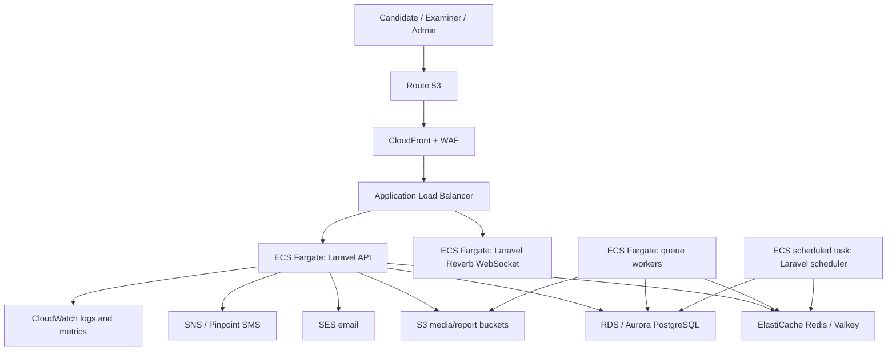

# AWS Deployment And Test Coverage Plan

Date: 2026-06-25  
Project: Exam Portal Laravel 13 Backend  
Repository: `/Users/abhaysingh/Desktop/exam portal`

## Recommendation

Use **PostgreSQL on Amazon RDS or Amazon Aurora PostgreSQL** as the primary database. Use **DynamoDB only for optional event-style workloads** later, such as append-only proctoring events, audit streams, or ultra-high-volume telemetry.

The exam portal data model is relational: users register for exams, exams contain sections, sections contain questions, questions have options or NAT answers, students create sessions, sessions own answers, answers produce results, and examiners review grading/proctoring data. PostgreSQL is a better fit because it supports relational constraints, joins, transactions, SQL analytics, indexes, and reporting without duplicating data across many access patterns.

DynamoDB is excellent when access patterns are known, key-based, and need huge serverless scale. AWS describes DynamoDB as a serverless, fully managed NoSQL database with single-digit millisecond performance at scale, but also notes that it does not support JOIN operations and recommends denormalized modeling. That makes it less natural for this portal's first backend.

Sources:

- AWS Laravel Elastic Beanstalk guide: <https://docs.aws.amazon.com/elasticbeanstalk/latest/dg/php-laravel-tutorial.html>
- AWS RDS for PostgreSQL: <https://docs.aws.amazon.com/AmazonRDS/latest/UserGuide/CHAP_PostgreSQL.html>
- AWS DynamoDB introduction: <https://docs.aws.amazon.com/amazondynamodb/latest/developerguide/Introduction.html>
- AWS ECS/Fargate: <https://docs.aws.amazon.com/AmazonECS/latest/developerguide/Welcome.html>
- AWS ElastiCache: <https://docs.aws.amazon.com/AmazonElastiCache/latest/dg/WhatIs.html>
- AWS S3: <https://docs.aws.amazon.com/AmazonS3/latest/userguide/Welcome.html>

## PostgreSQL vs DynamoDB

| Area | PostgreSQL / RDS | DynamoDB |
| --- | --- | --- |
| Best use | Relational business data, transactions, analytics, reporting | Key-value/document workloads with known access patterns |
| Exam portal fit | Best primary datastore | Good secondary event/telemetry datastore |
| Joins | Native SQL joins | No JOIN operator; requires denormalization |
| Constraints | Foreign keys, unique constraints, checks | Application-enforced relationships |
| Transactions | Mature relational transactions | ACID transactions available, but data modeling is different |
| Analytics | Strong SQL aggregation and reporting | Often needs export/ETL or precomputed views |
| Laravel fit | Native Eloquent support | Requires custom modeling/package choices |
| Scaling | RDS Multi-AZ, read replicas, Aurora, indexes, partitioning | Serverless scale with on-demand/provisioned capacity |

Decision:

- [x] Use PostgreSQL/RDS as source of truth.
- [x] Use Redis/ElastiCache for sessions, cache, queues, answer autosave buffers, locks, and leaderboard sorted sets.
- [ ] Consider DynamoDB later for immutable audit/proctoring event ingestion if PostgreSQL write volume becomes a bottleneck.

## AWS Service Mapping

| Component | AWS service | Why |
| --- | --- | --- |
| DNS | Route 53 | Domain routing for API and frontend |
| TLS certificates | AWS Certificate Manager | Managed HTTPS certs for ALB/CloudFront |
| Edge protection | AWS WAF + CloudFront | Bot/rate protection and static asset delivery |
| API load balancer | Application Load Balancer | HTTPS routing to Laravel containers; supports WebSocket upgrade traffic |
| Laravel API runtime | ECS Fargate | Containerized Laravel app without managing EC2 servers |
| Container registry | Amazon ECR | Stores backend Docker images |
| Primary database | Amazon RDS PostgreSQL or Aurora PostgreSQL | Relational source of truth |
| Cache/queue/session | ElastiCache Redis OSS or Valkey | Laravel cache, queues, locks, sessions, timer state, answer buffers |
| Object storage | S3 | Question images, proctoring screenshots, exports, reports |
| Queue jobs | Laravel queues on ElastiCache Redis; later SQS | Grading, reports, notifications |
| Email | Amazon SES | Exam reminders, registration, result notifications |
| SMS | Amazon SNS or Pinpoint | Optional SMS reminders and alerts |
| Secrets | AWS Secrets Manager or SSM Parameter Store | DB passwords, app key, API tokens |
| Logging/metrics | CloudWatch Logs + CloudWatch Metrics | Central logs, alarms, dashboards |
| Tracing | AWS X-Ray or OpenTelemetry collector | Request tracing across services |
| CI/CD | GitHub Actions + ECR + ECS deploy, or CodePipeline | Repeatable builds and deployments |
| Backups | AWS Backup + RDS automated backups + S3 lifecycle | Recovery and compliance |
| Security keys | KMS | Encryption keys for RDS, S3, secrets, logs |
| Network | VPC, private subnets, NAT gateway, security groups | Isolation and controlled outbound traffic |

## Deployment Architecture



## Environment Plan

### Development

- ECS Fargate optional; local Docker Compose is enough.
- RDS can be replaced by local PostgreSQL.
- ElastiCache can be replaced by local Redis.
- S3 can be replaced by MinIO if needed.

### Staging

- ECS Fargate service with 1-2 tasks.
- RDS PostgreSQL single-AZ or low-cost Multi-AZ depending on budget.
- ElastiCache small node/serverless cache.
- Separate S3 buckets and SES sandbox/test identities.

### Production

- ECS Fargate API service across at least two Availability Zones.
- Separate ECS services for API, queue workers, scheduler, and WebSocket/Reverb.
- RDS PostgreSQL Multi-AZ, automated backups, Performance Insights, encryption.
- RDS read replica or Aurora reader for analytics as traffic grows.
- ElastiCache Redis/Valkey Multi-AZ.
- S3 buckets with Block Public Access, encryption, lifecycle rules, and signed URLs.
- WAF managed rule groups and rate-based rules.
- CloudWatch alarms for latency, error rate, CPU/memory, queue depth, DB connections, Redis memory, and 5xx responses.

## Deployment Steps

### 1. Prepare Laravel App

- [ ] Install PHP 8.3+ and Composer locally.
- [ ] Run `composer install`.
- [ ] Create `.env` from `.env.example`.
- [ ] Run `php artisan key:generate`.
- [x] Run `vendor/bin/phpunit`.
- [ ] Add Dockerfile for Laravel PHP-FPM or Laravel Octane.
- [ ] Add Nginx config if using PHP-FPM.
- [ ] Add health endpoints: `/health/live` and `/health/ready`.
- [ ] Confirm `APP_ENV=production`, `APP_DEBUG=false`, `LOG_CHANNEL=stderr`.

### 2. Create AWS Foundation

- [ ] Create VPC with public and private subnets across at least two AZs.
- [ ] Put ALB in public subnets.
- [ ] Put ECS tasks, RDS, and ElastiCache in private subnets.
- [ ] Create NAT gateway for private outbound dependency downloads if needed.
- [ ] Create security groups:
  - ALB accepts `443` from internet.
  - ECS accepts app port only from ALB.
  - RDS accepts `5432` only from ECS security group.
  - Redis accepts `6379` only from ECS security group.

### 3. Create Data Services

- [ ] Create RDS PostgreSQL or Aurora PostgreSQL.
- [ ] Enable encryption with KMS.
- [ ] Enable automated backups and point-in-time recovery.
- [ ] Create ElastiCache Redis/Valkey.
- [ ] Create S3 buckets:
  - `exam-portal-media`
  - `exam-portal-proctoring`
  - `exam-portal-reports`
  - `exam-portal-exports`
- [ ] Enable S3 Block Public Access.
- [ ] Add lifecycle rules for screenshots and reports.

### 4. Secrets And Configuration

- [ ] Store `APP_KEY` in Secrets Manager.
- [ ] Store DB credentials in Secrets Manager.
- [ ] Store Redis endpoint, S3 bucket names, SES sender, and app URLs in SSM Parameter Store or ECS environment variables.
- [ ] Attach ECS task role with least-privilege permissions for S3, SES, CloudWatch, and Secrets Manager.

### 5. Build And Push Image

- [ ] Create ECR repository.
- [ ] Build Docker image.
- [ ] Run tests during build pipeline.
- [ ] Push image to ECR.
- [ ] Tag images with Git SHA and environment.

Example flow:

```bash
aws ecr create-repository --repository-name exam-portal-api
docker build -t exam-portal-api .
docker tag exam-portal-api:latest ACCOUNT_ID.dkr.ecr.REGION.amazonaws.com/exam-portal-api:latest
docker push ACCOUNT_ID.dkr.ecr.REGION.amazonaws.com/exam-portal-api:latest
```

### 6. Deploy ECS Services

- [ ] Create ECS cluster.
- [ ] Create task definition for API service.
- [ ] Create ECS service behind ALB.
- [ ] Create worker service running `php artisan queue:work`.
- [ ] Create scheduled ECS task running `php artisan schedule:run`.
- [ ] Create Reverb/WebSocket service when realtime features are implemented.
- [ ] Configure autoscaling by CPU, memory, request count, and queue depth.

### 7. Database Migration

- [ ] Run migrations as a one-off ECS task:

```bash
php artisan migrate --force
```

- [ ] Seed only safe production baseline data, not demo users:

```bash
php artisan db:seed --class=ProductionSeeder --force
```

### 8. Domain And HTTPS

- [ ] Request ACM certificate for `api.yourdomain.com`.
- [ ] Attach certificate to ALB listener.
- [ ] Create Route 53 alias record to ALB.
- [ ] Add WAF rules.
- [ ] Configure CORS for frontend domain.

### 9. Observability

- [ ] Send Laravel logs to CloudWatch.
- [ ] Add CloudWatch alarms:
  - API 5xx rate
  - ALB target unhealthy count
  - ECS CPU/memory
  - RDS CPU/connections/storage
  - Redis memory/evictions
  - Queue depth
  - Failed jobs
- [ ] Add dashboards for exam operations:
  - Active sessions
  - Answer saves per minute
  - Submission count
  - Proctoring flags
  - Grading queue depth

### 10. Release Strategy

- [ ] Use staging first.
- [ ] Run smoke tests after deploy.
- [ ] Use blue/green or rolling deployments.
- [ ] Run migrations before switching traffic if backward-compatible.
- [ ] Keep rollback image tags.
- [ ] Snapshot RDS before major schema changes.

## Alternative: Elastic Beanstalk

Elastic Beanstalk is easier for a first Laravel deployment because AWS has a Laravel-specific guide and it provisions EC2, load balancer, Auto Scaling, S3 artifacts, CloudWatch alarms, and CloudFormation resources. It is good for early demos.

Use Elastic Beanstalk if:

- You want the quickest first deployment.
- You do not want to write ECS task definitions yet.
- You are okay with less container-level control.

Use ECS Fargate if:

- You want production-grade service separation.
- You need separate API, queue worker, scheduler, and WebSocket services.
- You expect scaling and CI/CD maturity to matter.

Recommended path:

- Demo/MVP: Elastic Beanstalk or ECS Fargate.
- Production exam portal: ECS Fargate.

## Scenario Test Coverage

These are the scenarios that must be covered before production. The current repository includes starter feature tests for registration/session startup, but the full list below still needs automated tests once PHP/Composer are installed.

### Authentication

- [x] Register endpoint exists.
- [x] Login endpoint exists.
- [x] Logout endpoint exists.
- [ ] Test valid registration.
- [ ] Test duplicate email rejection.
- [ ] Test invalid password rejection.
- [ ] Test suspended user cannot login.
- [ ] Test authenticated `/me`.

### RBAC

- [x] Role middleware exists.
- [ ] Student cannot create exam.
- [ ] Student cannot publish/delete exam.
- [ ] Examiner can create/update draft exam.
- [ ] Examiner cannot publish/delete exam if admin-only policy remains.
- [ ] Admin can manage users and release results.

### Exam Management

- [x] Exam CRUD route surface exists.
- [ ] Create draft exam.
- [ ] Update only draft exam.
- [ ] Reject update for live/completed exam.
- [ ] Publish requires questions.
- [ ] Delete rejects live exam.
- [ ] List exams by status/category.

### Registration

- [x] Registration endpoint exists.
- [x] Starter test: student can register.
- [ ] Reject registration when capacity is full.
- [ ] Prevent duplicate registration.
- [ ] Withdraw registration.
- [ ] List my registrations.
- [ ] Examiner/admin can view registrations.

### Session Start

- [x] Session start endpoint exists.
- [x] Starter test: unregistered student cannot start.
- [x] Starter test: registered student can start live session.
- [ ] Reject if exam is draft/scheduled/completed.
- [ ] Prevent duplicate active sessions.
- [ ] Confirm IP and user agent are captured.
- [ ] Confirm randomized question order is stored.

### Answer Saving

- [x] Answer endpoint exists.
- [ ] Save MCQ answer.
- [ ] Save multi-correct answer.
- [ ] Save NAT answer.
- [ ] Save descriptive answer.
- [ ] Mark for review.
- [ ] Track visited question.
- [ ] Update existing answer with upsert.
- [ ] Reject answer after submission.
- [ ] Reject answer for question outside exam.

### Submission And Grading

- [x] Submit endpoint exists.
- [x] Grading service exists.
- [ ] Grade correct MCQ.
- [ ] Grade wrong MCQ with negative marking.
- [ ] Grade unattempted as zero.
- [ ] Grade NAT with tolerance.
- [ ] Grade multi-correct exact match.
- [ ] Queue descriptive answer for manual grading.
- [ ] Manual score recalculates result.
- [ ] Submission creates result.
- [ ] Timeout force-submit.

### Results

- [x] Result model exists.
- [ ] Student can view own result.
- [ ] Student cannot view another student's result.
- [ ] Examiner can view exam results.
- [ ] Admin can release results.
- [ ] Leaderboard orders by final score.
- [ ] Rank/percentile recomputation.

### Proctoring

- [x] Proctoring log endpoint exists.
- [ ] Student can submit own proctoring flag.
- [ ] Student cannot submit flag for another session.
- [ ] Examiner can list flags by exam/severity.
- [ ] Warn action records action.
- [ ] Dismiss action records action.
- [ ] Disqualify action updates session status.
- [ ] Screenshot upload stores private S3 object.

### Reports

- [x] Report generation route exists.
- [ ] Score report job is queued.
- [ ] Proctoring audit report job is queued.
- [ ] Item analysis report job is queued.
- [ ] Download requires signed URL and correct role.
- [ ] Failed report job is visible for retry.

### Analytics

- [x] Exam overview route exists.
- [ ] Active session count.
- [ ] Submitted session count.
- [ ] Average score.
- [ ] High-severity proctoring count.
- [ ] Score distribution endpoint.
- [ ] Question item analysis endpoint.

### Infrastructure And Deployment

- [ ] Docker image builds.
- [ ] Container starts with production env.
- [ ] `/health/live` returns success.
- [ ] `/health/ready` checks DB and Redis.
- [ ] Migrations run in staging.
- [ ] API service reaches RDS.
- [ ] API service reaches Redis.
- [ ] API service can write/read S3.
- [ ] Queue worker processes jobs.
- [ ] Scheduler runs.
- [ ] CloudWatch receives logs.
- [ ] WAF blocks obvious malicious traffic.
- [ ] HTTPS works.

### Load And Resilience

- [ ] k6 login/register baseline.
- [ ] k6 1,000 active students answer-save simulation.
- [ ] k6 10,000 active students simulation before claiming enterprise scale.
- [ ] Spike test at exam start.
- [ ] Submit storm test at final minute.
- [ ] Redis failover drill.
- [ ] RDS failover drill.
- [ ] ECS task replacement during live session.
- [ ] Restore RDS snapshot into staging.

## Test Commands To Run After PHP/Composer Install

```bash
composer install
cp .env.example .env
php artisan key:generate
php artisan migrate:fresh --seed
vendor/bin/phpunit
vendor/bin/pint --test
```

Suggested future test files:

- `tests/Feature/AuthTest.php`
- `tests/Feature/RbacTest.php`
- `tests/Feature/ExamManagementTest.php`
- `tests/Feature/RegistrationTest.php`
- `tests/Feature/SessionLifecycleTest.php`
- `tests/Feature/AnswerSavingTest.php`
- `tests/Feature/GradingTest.php`
- `tests/Feature/ProctoringTest.php`
- `tests/Feature/ReportsTest.php`
- `tests/Feature/AnalyticsTest.php`

## Current Verification Status

- [x] AWS deployment research completed against official AWS documentation.
- [x] PostgreSQL vs DynamoDB decision documented.
- [x] AWS component/service mapping documented.
- [x] Deployment checklist documented.
- [x] Scenario coverage checklist documented.
- [ ] Automated scenario tests have not been run because this machine's shell currently does not expose `php`, `composer`, or `laravel`.
- [ ] Full automated test coverage still needs to be implemented after Laravel dependencies are installed.
